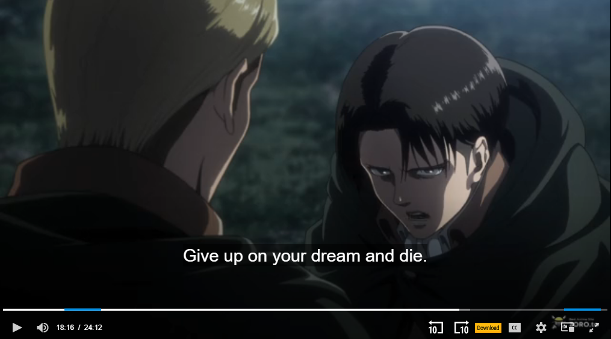

## Commander's Secret

in this challenge you are given a image file first things first lets [binwalk](https://github.com/ReFirmLabs/binwalk/tree/master) the image and we will get this 
```
$ binwalk  ervin.jpg

DECIMAL       HEXADECIMAL     DESCRIPTION
--------------------------------------------------------------------------------
0             0x0             JPEG image data, JFIF standard 1.01
30            0x1E            TIFF image data, little-endian offset of first image directory: 8
110814        0x1B0DE         Zip archive data, encrypted at least v2.0 to extract, compressed size: 572, uncompressed size: 1322, name: flag.txt
111546        0x1B3BA         End of Zip archive, footer length: 22

```
as you can see ther is a zip use `binwalk -e ervin.jpg` to extract the files
we get a password protracted zip file

now we will use `exiftool` to get the metadata image of the image 
```
$ exiftool  ervin.jpg

ExifTool Version Number         : 12.60
File Name                       : ervin.jpg
Directory                       : .
File Size                       : 112 kB
File Modification Date/Time     : 2023:04:21 18:46:48+05:30
File Access Date/Time           : 2023:04:21 18:46:42+05:30
File Inode Change Date/Time     : 2023:04:28 16:54:54+05:30
File Permissions                : -rw-r--r--
File Type                       : JPEG
File Type Extension             : jpg
MIME Type                       : image/jpeg
JFIF Version                    : 1.01
Exif Byte Order                 : Little-endian (Intel, II)
Image Description               : you are close , do not give up soldier
Orientation                     : Horizontal (normal)
X Resolution                    : 300
Y Resolution                    : 300
Resolution Unit                 : inches
Software                        : GIMP 2.10.34
Modify Date                     : 2023:04:19 10:37:53
Exif Version                    : 0220
User Comment                    : c2Vhc29uIDMgZXBpc29kZSAxNiAxODoxNgo=
Color Space                     : sRGB
Exif Image Width                : 1066
Exif Image Height               : 1600
Profile CMM Type                : Little CMS
Profile Version                 : 4.4.0
Profile Class                   : Display Device Profile
Color Space Data                : RGB
Profile Connection Space        : XYZ
Profile Date Time               : 2023:04:19 05:04:16
Profile File Signature          : acsp
Primary Platform                : Apple Computer Inc.
CMM Flags                       : Not Embedded, Independent
Device Manufacturer             : 
Device Model                    : 
Device Attributes               : Reflective, Glossy, Positive, Color
Rendering Intent                : Perceptual
Connection Space Illuminant     : 0.9642 1 0.82491
Profile Creator                 : Little CMS
Profile ID                      : 0
Profile Description             : GIMP built-in sRGB
Profile Copyright               : Public Domain
Media White Point               : 0.9642 1 0.82491
Chromatic Adaptation            : 1.04788 0.02292 -0.05022 0.02959 0.99048 -0.01707 -0.00925 0.01508 0.75168
Red Matrix Column               : 0.43604 0.22249 0.01392
Blue Matrix Column              : 0.14305 0.06061 0.71393
Green Matrix Column             : 0.38512 0.7169 0.09706
Red Tone Reproduction Curve     : (Binary data 32 bytes, use -b option to extract)
Green Tone Reproduction Curve   : (Binary data 32 bytes, use -b option to extract)
Blue Tone Reproduction Curve    : (Binary data 32 bytes, use -b option to extract)
Chromaticity Channels           : 3
Chromaticity Colorant           : Unknown
Chromaticity Channel 1          : 0.64 0.33002
Chromaticity Channel 2          : 0.3 0.60001
Chromaticity Channel 3          : 0.15001 0.06
Device Mfg Desc                 : GIMP
Device Model Desc               : sRGB
Comment                         : you are close , do not give up soldier
Image Width                     : 685
Image Height                    : 426
Encoding Process                : Progressive DCT, Huffman coding
Bits Per Sample                 : 8
Color Components                : 3
Y Cb Cr Sub Sampling            : YCbCr4:4:4 (1 1)
Image Size                      : 685x426
Megapixels                      : 0.292
```
we can see this line `User Comment  : c2Vhc29uIDMgZXBpc29kZSAxNiAxODoxNgo=` is sus by decodeing this base64 string we get  `season 3 episode 16 18:16` we could try using this as the password for the zip file it return as incorect  
since the image is from the show attack on titan if we go the specified episode we get this string 


`Give up on your dream and die.` by using this as the password for the zip file  we get flag.txt
but we dont have the flag yet if we open the file we get Erwins last speech we can find somthing odd about this file ther a lot of extra spaces this sign that a white space stego has been used 

whitespace stegno aka `stegsnow` when extracting the data we require a password that we dont know we could try all the words in the flag.txt but after a short while we relize it is not
So we need to use a tool call `snowcraker` which will do a dictionary attack on flag.txt and password list will the commom password list `Rockyou.txt` which will be found in `/usr/share/wordlist/rockyou.txt` if you are using kali 

by runing this `snowcracker -c N -f flag.txt -w /usr/share/wordlist/rockyou.txt` we get password as `wolverine` and flag as  `Xiomara{d0nt_l00k_b4ck_ch4rge3_4h34d_s0ld13r}`


