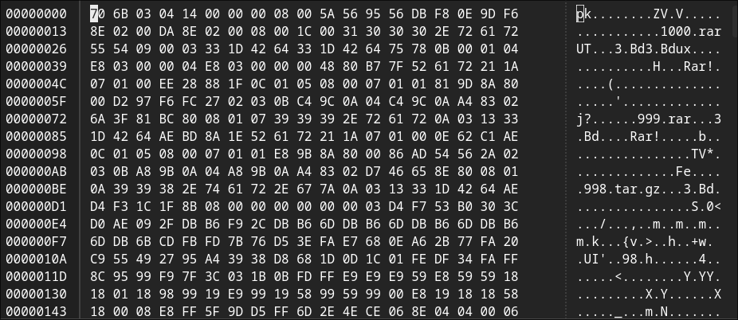

## Zip It Up

a zip file was provied for this challenge
if you try to unzip you would get a error like this 
```
unzip 1001.zip
Archive:  1001.zip
file #1:  bad zipfile offset (local header sig):  0
```
which would indicate ther is a problem with the header 

open the file any hex editor i will use [ghex](https://github.com/GNOME/ghex.git)


if you check the [magic number of file]() you can see a zip file header starts with `PK` not `pk` by corecting this we can unzip the file 
